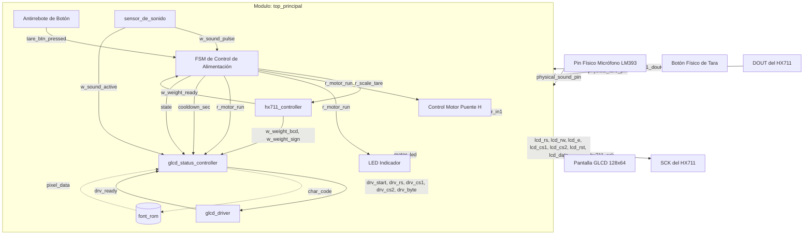

# Alimentador Automatizado de Gatos (Automated Cat Feeder) - Proyecto Digital

Este proyecto consiste en un sistema embebido diseñado en **Verilog HDL** para controlar un comedero automatizado de mascotas (gatos) utilizando una FPGA. El sistema integra sensores físicos (sensor de sonido LM393 para detectar maullidos y una celda de carga con amplificador HX711 para pesar la comida), actuadores (motor de dispensación controlado por un puente H y un LED indicador) y una interfaz gráfica en una pantalla de cristal líquido gráfica (GLCD 128x64 basada en el controlador KS0108).

El sistema de producción está gobernado por el módulo de nivel superior `top_principal.v`, el cual orquesta la lógica de control principal y conecta los distintos submódulos para el procesamiento analógico de señales, el dibujado en pantalla y la toma de decisiones.

---

## 1. Arquitectura General y Jerarquía de Módulos

El proyecto está estructurado de forma modular para facilitar la depuración y reutilización de componentes. A continuación se describe la jerarquía del sistema de producción:

### Nivel Superior: [top_principal.v](file:///c:/Users/jesus/AppData/Local/quartus/Proyecto_Digital/top_principal.v)
*   **`sensor_de_sonido`** ([sensor_de_sonido.v](file:///c:/Users/jesus/AppData/Local/quartus/Proyecto_Digital/sensor_de_sonido.v)): Filtra y procesa los impulsos eléctricos digitales del micrófono LM393 para convertirlos en eventos estables de maullido.
*   **`hx711_controller`** ([hx711_controller.v](file:///c:/Users/jesus/AppData/Local/quartus/Proyecto_Digital/hx711_controller.v)): Implementa la comunicación serie por bit-banging con el módulo HX711, aplica filtros digitales y escala las lecturas a gramos decimales.
*   **`glcd_driver`** ([glcd_driver.v](file:///c:/Users/jesus/AppData/Local/quartus/Proyecto_Digital/glcd_driver.v)): Módulo de bajo nivel encargado de la temporización y el protocolo físico de escritura del KS0108 (GLCD).
*   **`glcd_status_controller`** ([glcd_status_controller.v](file:///c:/Users/jesus/AppData/Local/quartus/Proyecto_Digital/glcd_status_controller.v)): Coordina qué texto e información se dibuja en la pantalla en función del estado del sistema. Instancia a:
    *   **`font_rom`** ([font_rom.v](file:///c:/Users/jesus/AppData/Local/quartus/Proyecto_Digital/font_rom.v)): Memoria de caracteres ASCII en una cuadrícula de 5x7 píxeles.

### Diagrama de Interconexión de Submódulos

---

## 2. Flujo de Funcionamiento del Sistema y Máquina de Estados (FSM)

El comportamiento lógico principal del comedero está regulado por una **Máquina de Estados Finita (FSM)** síncrona en el módulo de nivel superior `top_principal.v`. Esta máquina toma decisiones basándose en el tiempo transcurrido, la señal del sensor de sonido y el peso medido por la celda de carga.

### Definición de Estados de la FSM

1.  **`ST_IDLE` (Reposo - Valor `3'd0`):**
    *   **Comportamiento:** El motor y el indicador LED permanecen apagados. El sistema se encuentra a la espera de un evento de activación.
    *   **Toma de Decisiones / Transición:** El sistema permanece en reposo hasta que ocurra uno de los siguientes eventos:
        *   Detección de un maullido (`w_sound_pulse` en nivel alto).
        *   Presión física del botón de tara (`tare_btn_pressed` detectado).
        *   *Efecto:* Cualquiera de estos eventos hace que la máquina transicione al estado **`ST_TARE`**.

2.  **`ST_TARE` (Tara Automática - Valor `3'd1`):**
    *   **Comportamiento:** Se activa la señal `r_scale_tare` hacia el controlador de la celda de carga para tomar la lectura actual como peso cero ("cero relativo"). Esto asegura que si hay restos de comida previos en el plato o polvo, no afecten la medición de la nueva porción.
    *   **Toma de Decisiones / Transición:** Un temporizador interno (`timer_ms`) cuenta 500 milisegundos para permitir que la lectura de la balanza se estabilice tras el offset. Al llegar a `500 ms`, el temporizador se limpia y la FSM transiciona a **`ST_DISPENSE`**.

3.  **`ST_DISPENSE` (Dispensación Inicial - Valor `3'd2`):**
    *   **Comportamiento:** Se activa la salida del motor (`r_motor_run`) y el LED indicador de dispensación. El motor comienza a girar para dejar caer la comida en el plato.
    *   **Toma de Decisiones / Transición:** Para evitar lecturas inestables de peso mientras el plato recibe los primeros impactos de la comida (ruido dinámico y rebotes mecánicos), el motor se mantiene encendido de forma obligatoria durante un tiempo mínimo inicial de 200 milisegundos. Transcurrido este tiempo (`timer_ms >= 200`), la FSM pasa al estado **`ST_CHECK_WEIGHT`**.

4.  **`ST_CHECK_WEIGHT` (Monitoreo de Peso - Valor `3'd3`):**
    *   **Comportamiento:** El motor de dispensación continúa encendido (`r_motor_run` activo). Se monitorea activamente el peso reportado por la celda de carga.
    *   **Toma de Decisiones / Transición:** Cuando se recibe una lectura válida (`w_weight_ready` en alto), el peso no es negativo (`!w_weight_sign`) y su valor en gramos en formato BCD es mayor o igual al límite configurado (definido por el parámetro `TARGET_WEIGHT_BCD`, por defecto 40 gramos: `16'h0040`):
        *   Se apaga la solicitud del motor (`r_motor_run` se pone en 0).
        *   Se carga el contador de descanso con el valor de cooldown (por ejemplo, 30 segundos para pruebas o 2 horas para producción).
        *   La FSM transiciona a **`ST_COOLDOWN`**.

5.  **`ST_COOLDOWN` (Tiempo de Descanso / Cooldown - Valor `3'd4`):**
    *   **Comportamiento:** El motor y el LED se apagan. La pantalla muestra un mensaje de espera indicando el tiempo regresivo restante en segundos y el peso neto actual de la comida en el plato. Esto previene la sobrealimentación al bloquear nuevas solicitudes de comida.
    *   **Toma de Decisiones / Transición:** En cada tick de 1 segundo (`tick_sec`), el contador regresivo `cooldown_sec` disminuye en uno. Para retornar al estado **`ST_IDLE`**, se deben cumplir simultáneamente dos condiciones:
        *   Que el temporizador de descanso haya terminado (`cooldown_sec == 0`).
        *   Que la celda de carga registre 0 gramos (o un valor menor debido a posible ruido, es decir, `weight_bcd == 0` o con signo negativo activo).
        *   *Efecto:* Esto asegura que el comedero no volverá a dispensar alimento hasta que el gato haya terminado de comer la porción anterior, garantizando un control óptimo de alimentación.

---

## 3. Explicación Detallada de los Submódulos

A continuación se desglosa el principio físico de operación, el flujo de señales interno y las decisiones de diseño para cada módulo de hardware lógico del proyecto.

---

### A. Procesamiento de Audio ([sensor_de_sonido.v](file:///c:/Users/jesus/AppData/Local/quartus/Proyecto_Digital/sensor_de_sonido.v))
El sensor de sonido físico LM393 entrega una salida digital (0 o 1) que oscila rápidamente a la frecuencia del sonido detectado cuando supera un umbral analógico regulado por potenciómetro. Una FPGA no puede usar esta señal directamente, ya que oscila velozmente y generaría múltiples falsos disparos.

#### Flujo de Funcionamiento e Interconexión:
1.  **Filtro Antmetaestabilidad:** La señal analógica digitalizada del pin físico `sound_raw` ingresa a un sincronizador de dos flip-flops (`sound_s0`, `sound_s1`) en cascada, sincronizados con el reloj rápido de la FPGA (50 MHz).
2.  **Extractor de Envolvente por Transición:** En cada ciclo de reloj se compara el estado actual filtrado `sound_s0` con el estado del ciclo anterior `sound_s1`. Si difieren (`sound_s0 != sound_s1`), significa que el micrófono está oscilando (hay sonido presente).
3.  **Temporizador de Sostenimiento (Hold):** Al detectar cualquier transición, el registro `sound_active` se pone inmediatamente en alto (1) y un contador interno (`hold_timer`) se recarga con el valor `TICKS_HOLD` (equivalente a 1 segundo: 50,000,000 ciclos a 50 MHz). Mientras el temporizador sea mayor a cero, decrementa en 1 en cada ciclo y mantiene `sound_active` en alto. Si pasa 1 segundo entero sin transiciones, `sound_active` regresa a bajo (0).
4.  **Generador de Pulso de Flanco:** Se genera un pulso de un solo ciclo de reloj de 50 MHz (`sound_pulse`) coincidiendo exactamente con el flanco de subida de `sound_active`. Este pulso es el que utiliza la FSM principal para despertar de `ST_IDLE`.

---

### B. Controlador de Celda de Carga ([hx711_controller.v](file:///c:/Users/jesus/AppData/Local/quartus/Proyecto_Digital/hx711_controller.v))
El convertidor analógico-digital de 24 bits HX711 se comunica a través de una interfaz síncrona no estándar (bit-banging). Requiere enviar pulsos de reloj por su pin de entrada `SCK` y leer secuencialmente el pin de datos `DOUT`.

#### Flujo de Funcionamiento:
1.  **Divisor de Reloj SCK:** Genera una base de tiempo interna de 1 MHz (`clk_1mhz_en`) a partir de la entrada de 50 MHz. Esto limita la velocidad del puerto serie para cumplir con los requisitos temporales del HX711 (duración mínima de pulsos SCK).
2.  **FSM del Protocolo de Lectura:**
    *   **`IDLE` (Estado `1'b0`):** El pin `SCK` se mantiene en bajo. Se monitorea la señal `DOUT`. Cuando el chip HX711 termina una conversión analógica-digital interna, arrastra la línea `DOUT` a bajo. En ese instante, la FSM pasa al estado `READ`.
    *   **`READ` (Estado `1'b1`):** Genera pulsos en `SCK` alternando su valor.
        *   *Flanco de Subida:* Se incrementa el contador de bits (`bit_count`). Si es menor o igual a 24, se introduce el estado de la línea `DOUT` en un registro de desplazamiento de 24 bits (`shift_reg`).
        *   *Flanco de Bajada:* En el ciclo número 25, se transfiere el búfer completo de datos hacia el registro `raw_data_reg` y se activa una bandera de aviso (`data_ready_flag`), regresando al estado `IDLE`. (Este pulso número 25 también le indica al chip HX711 que configure una ganancia de 128 para la siguiente medición en el Canal A).
3.  **Filtro IIR (Respuesta al Impulso Infinita):**
    Para mitigar las fluctuaciones espurias debidas al ruido eléctrico de la celda de carga, el dato crudo pasa por un filtro de paso bajo IIR de primer orden modelado matemáticamente mediante desplazamientos de bits (desplazamientos lógicos a la derecha para simular divisiones de potencias de 2):
    
    $$\text{next\\_filtered\\_raw\\_data} = \text{filtered\\_raw\\_data} + \frac{\text{raw\\_data\\_reg} - \text{filtered\\_raw\\_data}}{2^{\text{FILTER\\_SHIFT}}}$$
    
    *   Si `FILTER_SHIFT` es 2 (rápido), la balanza reacciona rápido (~1 segundo). Si es 4, filtra mucho más ruido pero tarda un poco más en estabilizarse.
    *   En los primeros 10 ciclos tras el arranque (`filter_init_counter < 10`), el filtro se salta para cargarse directamente con el valor real y no arrancar con lecturas erróneas desde cero.
4.  **Calibración y Escalado Matemático:**
    *   **Tara:** Si la FSM de control levanta la línea `tare_req`, el valor filtrado actual se guarda en `offset_reg`.
    *   **Resta de Offset:** Se calcula el valor neto del peso restando el offset guardado: `net_data = active_filtered_data - offset_reg`.
    *   **Escalado:** Para obtener gramos reales, se multiplica por un factor de calibración (`SCALE_MULT`) y se desplaza hacia la derecha (`SCALE_SHIFT` posiciones) para simular una división fraccionaria de punto fijo de precisión:
        
        $$\text{scaled\\_data} = \frac{\text{net\\_data} \times \text{SCALE\\_MULT}}{2^{\text{SCALE\\_SHIFT}}}$$

5.  **Conversión Binario a BCD (Algoritmo Double Dabble):**
    Una vez obtenido el valor absoluto del peso en gramos como un número binario estándar (`abs_weight_bin`), se pasa por un bloque combinacional que ejecuta el algoritmo *Double Dabble* (desplazar y sumar 3). Este algoritmo toma el número binario de 14 bits y entrega 4 grupos de 4 bits representativos de los dígitos decimales (Miles, Centenas, Decenas y Unidades) para su fácil impresión en pantalla.

---

### C. Sistema de Visualización GLCD 128x64
La pantalla gráfica de 128x64 píxeles utiliza dos chips controladores internos KS0108 (cada uno maneja una mitad horizontal de 64x64 píxeles). La pantalla se organiza verticalmente en 8 páginas (de la 0 a la 7), donde cada página tiene 8 píxeles de altura.

#### Submódulo: Driver Físico ([glcd_driver.v](file:///c:/Users/jesus/AppData/Local/quartus/Proyecto_Digital/glcd_driver.v))
Implementa las especificaciones físicas de escritura del circuito integrado KS0108 en un ciclo de reloj de 1 MHz. Es una máquina de estados controlada por banderas de control:
*   **`ST_IDLE`:** Mantiene la línea `lcd_e` (Enable) en bajo y levanta la bandera `ready` en 1. Espera a que un módulo de nivel superior coloque datos en el bus y pulse `start`.
*   **`ST_SETUP`:** Captura las señales de direccionamiento (`rs_in` para comando o dato, `cs1_in` y `cs2_in` para seleccionar la mitad izquierda o derecha de la pantalla, y `data_in` para el byte correspondiente), baja la bandera `ready` y sube `lcd_e` a alto.
*   **`ST_PULSE`:** Sostiene el pin `lcd_e` en alto durante un tiempo determinado y luego lo baja a 0. En este flanco de bajada, los chips controladores de la pantalla leen físicamente el bus de datos (`lcd_data`).
*   **`ST_HOLD`:** Sostiene un tiempo de espera de recuperación (para que la pantalla asimile los datos) antes de volver a colocar `ready` en alto y retornar a reposo.

#### Submódulo: Controlador de Visualización de Estado ([glcd_status_controller.v](file:///c:/Users/jesus/AppData/Local/quartus/Proyecto_Digital/glcd_status_controller.v))
Este módulo es el cerebro gráfico. Actúa como un motor de texto y un actualizador periódico de pantalla (cada 100 ms solicita un refresco completo de la pantalla para evitar parpadeos y reflejar los valores en tiempo real).

*   **Páginas y Formato:**
    *   **Layout Estándar (4 líneas):** En los estados normales (`ST_IDLE`, `ST_TARE`, `ST_DISPENSE`, `ST_CHECK_WEIGHT`), divide la pantalla en 4 líneas utilizando páginas alternas (Línea 0 -> Página 1, Línea 1 -> Página 3, Línea 2 -> Página 5, Línea 3 -> Página 7). Las páginas 0, 2, 4 y 6 quedan vacías como márgenes para mejorar la legibilidad.
    *   **Layout de Cooldown (5 líneas):** En el estado `ST_COOLDOWN`, se reajusta el layout para mostrar el peso restante en la última línea física (Página 7) de la pantalla. Utiliza las páginas 1, 3, 5, 6 y 7 (Línea 0 -> Página 1: `"ESTAMOS ESPERANDO QUE"`, Línea 1 -> Página 3: `"TERMINES DE COMER"`, Línea 2 -> Página 5: `"GATITO PARA QUE ESTES"`, Línea 3 -> Página 6: `"SANO:       [tiempo] s"`, Línea 4 -> Página 7: `"PESO:       [valor] g"`). Esto mantiene el espaciado doble original para el mensaje principal en la parte superior y deja vacías las páginas 0, 2 y 4 como márgenes.
*   **Decodificador de Texto Dinámico:** Dependiendo del estado actual de la FSM de alimentación (`fsm_state_reg`), el decodificador mapea secuencialmente para cada índice de carácter (0 a 20) el código ASCII que se debe dibujar.
*   **Integración con la ROM de Fuentes:** A partir del código ASCII determinado, el controlador direcciona la ROM (`font_rom.v`) columna por columna (0 a 4) para obtener el patrón de 8 píxeles verticales del carácter.
*   **Máquina de Refresco de Pantalla:**
    1.  **Limpieza inicial (`ST_CLEAR_PAGE` / `ST_CLEAR_WRITE`):** Al iniciar o al cambiar de modo, el controlador barre las 8 páginas y las 128 columnas escribiendo `8'h00` para borrar cualquier residuo en la memoria de la pantalla.
    2.  **Direccionamiento de Página (`ST_SET_PAGE`):** Envía el comando de selección de página física a la pantalla activando ambos integrados (`CS1=1`, `CS2=1`).
    3.  **Direccionamiento de Columna (`ST_SET_Y`):** Dependiendo de la columna absoluta (0 a 127), activa dinámicamente `CS1` (mitad izquierda, columnas 0-63) o `CS2` (mitad derecha, columnas 64-127) y transmite la dirección local de la columna (0 a 63).
    4.  **Escritura de Datos (`ST_WRITE_DAT`):** Envía el patrón de píxeles recuperado de la ROM al driver de bajo nivel. Introduce una columna vacía (`8'h00`) como espacio después de cada carácter.

---

## 4. Resumen de Interconexión de Señales Clave

| Señal en Código | Dirección | Pin Físico Típico | Propósito |
| :--- | :---: | :---: | :--- |
| `clk_50mhz` | Entrada | Reloj del sistema FPGA | Base de tiempo maestro (50 MHz). |
| `rst_n` | Entrada | Pulsador de Reset | Inicialización asíncrona del hardware (activo en bajo). |
| `physical_sound_pin`| Entrada | Pin del Micrófono LM393 | Señal digital pulsante de sonido. |
| `physical_tare_pin` | Entrada | Pulsador físico de Tara | Calibración manual instantánea a cero gramos. |
| `hx711_dout` | Entrada | Pin DOUT del HX711 | Datos serie de la celda de carga. |
| `hx711_sck` | Salida | Pin SCK del HX711 | Generación de pulsos de reloj de lectura. |
| `motor_in1` | Salida | Entrada IN1 del Puente H L298N| Activa el motor para dispensar alimento (activo en alto). |
| `motor_led` | Salida | Diodo LED externo | Indicador visual de motor en funcionamiento (activo en alto). |
| `lcd_rs` | Salida | RS (Register Select) GLCD | `0` para Comandos, `1` para Datos. |
| `lcd_rw` | Salida | R/W (Read/Write) GLCD | Conectado permanentemente a `0` (Escritura). |
| `lcd_e` | Salida | E (Enable) GLCD | Pulso habilitador de escritura en flanco de bajada. |
| `lcd_cs1` / `lcd_cs2` | Salida | CS1, CS2 (Chip Select) GLCD| Selecciona la mitad izquierda (0-63) o derecha (64-127) de la pantalla. |
| `lcd_rst` | Salida | Reset GLCD | Conectado a `1` (Habilitado continuo). |
| `lcd_data` | Salida | Bus de Datos D0-D7 GLCD | Envío del código del comando o patrón de píxeles. |
